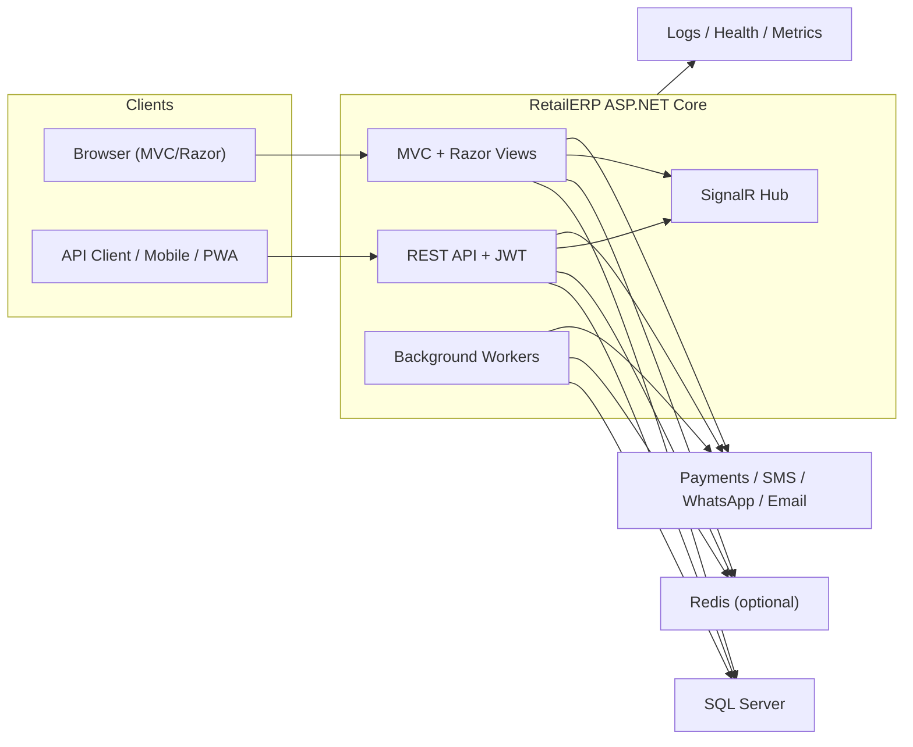

# RetailERP - High-Level Architecture

Use this file for onboarding, viva preparation, and high-level technical explanation.

## System context

## Request flow

1. Browser requests are authenticated with ASP.NET Identity cookies and handled through MVC controllers and service classes.
2. API requests use JWT bearer authentication and pass through `ApiBaseController` plus role and tenant checks.
3. Business logic lives in service classes such as POS billing, invoices, purchases, loyalty, forecasting, notifications, and sync.
4. EF Core persists data through `ApplicationDbContext` to SQL Server with tenant-aware filters and audit support.
5. SignalR pushes near-real-time updates after billing, invoicing, stock alerts, and EOD events.
6. Hosted background workers process email queues, sync queues, stock alerts, and scheduled EOD tasks.
7. Redis is used when configured for distributed cache and data-protection key persistence, with in-memory fallback when unavailable.

## Layering

| Layer | Responsibility |
| --- | --- |
| Controllers | HTTP endpoints, view models, input validation, authorization |
| Services | Core business rules and orchestration |
| Data | EF Core entities, migrations, tenant filters, indexes, audit persistence |
| Infrastructure | Middleware, startup configuration, health checks, Swagger, production validation |
| Integrations | Razorpay, SMTP, SMS, WhatsApp, GST/e-invoice helpers |

## Multi-tenancy model

- Tenant identity is derived from the authenticated user's `CompanyId` claim.
- Tenant entities implement `ITenantEntity`.
- Global query filters scope tenant-owned rows automatically.
- New tenant-owned rows are auto-stamped with `CompanyId` in `ApplicationDbContext`.
- SuperAdmin flows can bypass tenant filters where explicitly intended.

## Real-time and background processing

- `EmailSenderWorker`: drains queued email notifications.
- `StockAlertWorker`: scans low-stock thresholds and pushes alerts.
- `SyncQueueWorker`: processes offline/PWA sync queue entries.
- `EodAutoWorker`: triggers daily end-of-day processing per active store.

## Operability

- `GET /health`: broad liveness-style check.
- `GET /health/ready`: readiness-oriented check for SQL and Redis.
- `GET /metrics`: Prometheus-style counters and timing metrics.
- Serilog file logging plus correlation IDs provide traceability across requests.

## Current architectural note

The project already contains `Infrastructure/WebApplicationBuilderExtensions.cs` and `Infrastructure/WebApplicationExtensions.cs`, but startup composition still has overlap with `Program.cs`. Consolidating those paths is one of the highest-value maintainability cleanups left in the codebase.

See also:

- `RUNBOOK.md`
- `PRODUCTION_DEPLOYMENT.md`
- `SECURITY_CHECKLIST.md`
