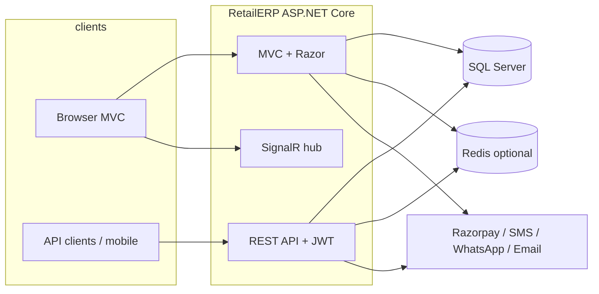

# RetailERP — high-level architecture

Use this for **viva / demo** explanations and onboarding.

## System context

## Request flow (typical)

1. **Browser:** IIS / Kestrel → authentication (cookies + Identity) → MVC controller → services → `ApplicationDbContext` → SQL.
2. **API:** JWT bearer → `ApiBaseController` / policies → same services and EF Core with **tenant scoping** (company claims).
3. **Background:** hosted workers (`EmailSenderWorker`, `SyncQueueWorker`, etc.) use scoped services via `IServiceScopeFactory` — **never** use a request `DbContext` after the HTTP request completes.

## Layering

| Layer | Responsibility |
|-------|------------------|
| **Controllers** | HTTP, validation, authorization, view models / DTOs |
| **Services** | Business rules (POS billing, stock, GST, sync, notifications) |
| **Data** | EF Core `ApplicationDbContext`, entities, migrations, interceptors (audit) |
| **Infrastructure** | Startup (`AddRetailErp`), middleware pipeline, health checks, Swagger |

## Multi-tenancy

- Tenant identity is carried in claims; entities implement `ITenantEntity` where applicable.
- Global query filters and explicit checks on sensitive actions reduce cross-company access.

## Operability

- **`GET /health`** — liveness-style: all registered checks.
- **`GET /health/ready`** — JSON, only checks tagged `ready` (SQL + Redis when enabled), suitable for load balancer / Kubernetes readiness probes.

See also: `RUNBOOK.md`, `PRODUCTION_DEPLOYMENT.md`, `SECURITY_CHECKLIST.md`.
